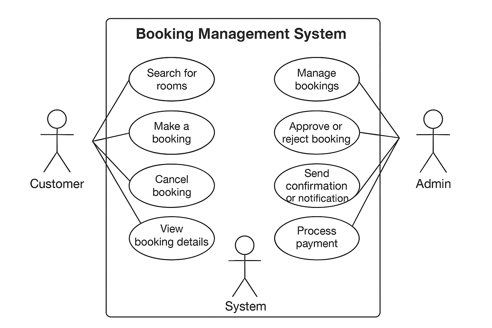

# Requirement Analysis in Software Development

## Introduction
This repository is created as part of the ALX_FeatureForge: Crafting Project Blueprint.  
It focuses on the Requirement Analysis phase of the Software Development Life Cycle (SDLC), a crucial stage that defines what a system must do before design and implementation begin.

The purpose of this repository is to:
- Document the requirements for a Booking Management System.
- Differentiate between functional and non-functional requirements.
- Provide use case diagrams and acceptance criteria.
- Demonstrate how proper requirement analysis lays a solid foundation for successful software development.

All documentation will follow industry-standard practices, including well-structured markdown, organized folders, and clear visual representations of system requirements.

## What is Requirement Analysis?

Requirement Analysis means finding out what a software system should do and what users expect from it. It is the process of gathering, studying, and writing down all the needs of the people who will use or manage the system. This step is very important in the Software Development Life Cycle (SDLC) because it helps everyone clearly understand what needs to be built before the actual design or coding starts. If this step is not done well, the software may not solve the right problems or meet user needs.

### Importance in the SDLC
- It helps everyone agree on what the software should do.
- It saves time and cost by reducing mistakes later in the project.
- It improves software quality because the system meets real user needs.
- It helps in planning time, cost, and resources better.

In simple terms, Requirement Analysis is like drawing a clear plan before building a house, it makes sure everyone knows what to build and how it should work.

## Importance of Requirement Analysis?

Requirement Analysis is a very important step in software development. It helps the team understand what to build and how to make sure the system meets user needs.  
Some key reasons why it is so important in the Software Development Life Cycle (SDLC) are:
- Clear Understanding of Goals: It helps everyone (developers, designers, and clients) understand exactly what the software should do. This prevents confusion and makes sure all team members work toward the same goal.
- Saves Time and Cost: Finding and fixing mistakes in requirements early is much cheaper than correcting them later during coding or testing. Good requirement analysis reduces rework and helps finish projects faster.
- Improves Software Quality: When requirements are clear and correct, the final product is more useful, reliable, and user-friendly. It ensures that the system meets both business needs and user expectations.
- Better Planning and Communication: Well-defined requirements help in estimating time, cost, and resources more accurately. It also improves communication between developers and stakeholders.

## Key Activities in Requirement Analysis
- Requirement Gathering: This is the first step where information is collected from users, clients, and other stakeholders. The goal is to understand what they need from the system.
- Requirement Elicitation: This means asking the right questions and using methods like interviews, surveys, and meetings to bring out the real needs of users. It helps to discover both stated and hidden requirements.
- Requirement Documentation: All gathered and elicited requirements are written down clearly and in an organized way. This helps developers, designers, and testers refer to a common document.
- Requirement Analysis and Modeling: In this step, the team studies the requirements to check if they are clear, complete, and possible to achieve. Diagrams and models may be created to show how the system will work.
- Requirement Validation: This step makes sure that the documented requirements match what users and clients actually want. It helps confirm that the system will meet real needs before development begins.

## Types of Requirements

### Functional Requirements  
Functional requirements describe what the system must do. They specify actions, services or tasks that the system will perform. Examples of functional requirements for our booking management system include:
- The system must allow a user to search available rooms or slots based on date, location, and other filters.  
- The system must allow a user to make a booking by selecting an available slot, providing required details, and confirming payment.  
- The system must allow an administrator to approve or reject booking requests.  
- The system must allow a user to view, modify or cancel their existing bookings.  
- The system must generate and send booking confirmation notifications to the user after a successful booking.

### Non-functional Requirements  
Non-functional requirements describe how the system must behave or the qualities it must have. They define attributes such as performance, usability, reliability and security. Examples of non-functional requirements for our booking management system include:
- Performance: The system should respond to search requests and display results within 2 seconds for 95% of user queries.  
- Availability: The system should be available (up and running) at least 99.9% of the time in a month.  
- Security: User personal data and payment information must be encrypted and stored securely; only authorized staff may access administrative functions.  
- Usability: The booking interface should be simple and mobile-friendly, enabling users to complete a booking in three steps or fewer.  
- Scalability: The system should handle at least 10,000 concurrent users without performance degradation, allowing room for future growth.

## Use Case Diagrams
A Use Case Diagram shows how users (called actors) interact with a system. It helps everyone understand what the system does and who uses it.Benefits of use case diagrams include:
- They give a simple visual overview of system functions.  
- They help identify the main users (actors) of the system.  
- They make communication between developers and clients easier.  
- They act as a guide when designing and testing the system.

### Use Case Diagram for Booking Management System
Below is the use case diagram showing the main actors and their interactions with the system.

Actors:
- Customer: Searches, books, and cancels reservations.  
- Admin: Manages availability and approves or rejects bookings.  
- System: Sends confirmations and notifications automatically.

## Acceptance Criteria
Acceptance Criteria are the specific conditions or rules that a software feature must meet to be accepted by the client or end user. They describe how a feature should work and what results are expected when it is used correctly.

### Importance of Acceptance Criteria
- They help developers and testers understand what the feature must do before development starts.  
- They ensure everyone (developers, testers, and clients) has the same understanding of what “done” means.  
- They make testing easier because they provide clear success conditions.  
- They reduce misunderstandings and rework by setting clear expectations early.  

### Example: Checkout Feature in Booking Management System
Feature:Checkout and Payment Process
Acceptance Criteria
1. When a user proceeds to checkout after selecting a room, the system must display the booking summary (room details, price, and total cost).  
2. The user must be able to choose a payment method (e.g., credit card, PayPal, or bank transfer).  
3. The system must validate payment details before processing the transaction.  
4. When payment is successful, the system must generate a booking confirmation and send an email notification to the user.  
5. If payment fails, the system must display an error message and allow the user to retry.  
6. The booking should appear under the user’s “My Bookings” section after a successful payment.
